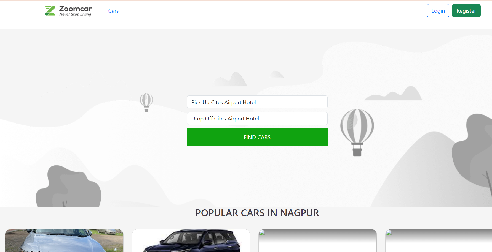

# ZOOMCAR

# app.module.ts (Like before angular-17 without standalone)
# Image add in public
# Modal => Nav bar page | doucment.getElementId()
# Template driven Form
# 'HttpClientModule' is deprecated => provideHttpClient()
# Cross origin
# Local storage data 
# Login and Logout data as per condition show
# Reusable copmponent create 'cars-card' send to car,Home(PopularCar) as child help of @Input
# pass location id in home page help of query parameter and recive in search page
# as per location id showing data in location also you can choose another location also that feture added help of (change)
#  <select> <option></option> </select> plce hoder no show solve help of declare variable properly fromLocation:String = '';

# This project was generated with [Angular CLI](https://github.com/angular/angular-cli) version 18.2.2.

## Development server

Run `ng serve` for a dev server. Navigate to `http://localhost:4200/`. The application will automatically reload if you change any of the source files.

## Code scaffolding

Run `ng generate component component-name` to generate a new component. You can also use `ng generate directive|pipe|service|class|guard|interface|enum|module`.

## Build

Run `ng build` to build the project. The build artifacts will be stored in the `dist/` directory.

## Running unit tests

Run `ng test` to execute the unit tests via [Karma](https://karma-runner.github.io).

## Running end-to-end tests

Run `ng e2e` to execute the end-to-end tests via a platform of your choice. To use this command, you need to first add a package that implements end-to-end testing capabilities.

## Further help

To get more help on the Angular CLI use `ng help` or go check out the [Angular CLI Overview and Command Reference](https://angular.dev/tools/cli) page.
